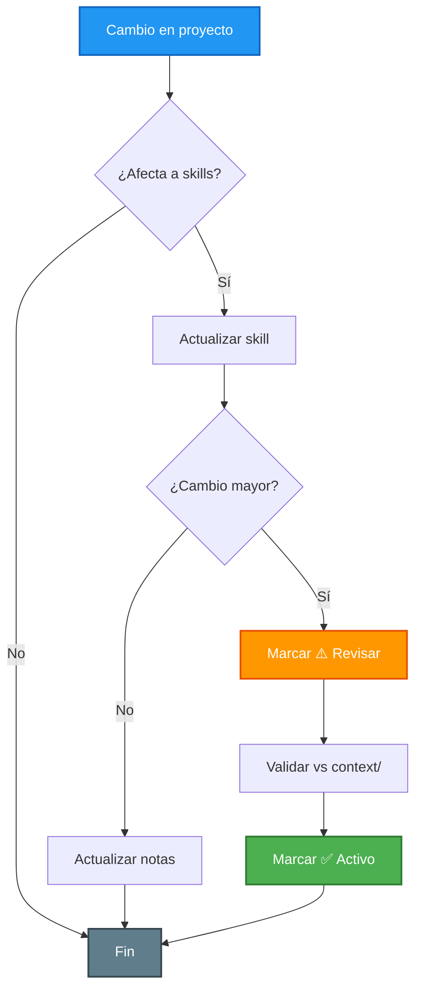

# 🎛️ Reglas de Activación de Skills

## 🎯 Propósito
Controlar qué "cerebros" están encendidos para evitar alucinaciones y optimizar el uso de la ventana de contexto de la IA.

> **Terminología:** Se usa **skill** como término principal. La fuente canónica instalada por el CLI es `.agents/skills/`. Las skills adaptadas al proyecto se mantendrán en esa fuente y los agentes compatibles podrán descubrirlas mediante sus rutas oficiales o symlinks controlados. `ai-docs/skills/` queda pendiente de consolidación y no debe duplicar skills activas. Los archivos en `agents/` son **legacy** (mantener solo como referencia histórica).

---

## 📚 Jerarquía de Autoridad

Cuando haya conflicto entre fuentes, seguir este orden de prioridad:

| Prioridad | Fuente | Cuándo consultar |
|-----------|--------|------------------|
| 1️⃣ | `context/identity/` | Identidad del proyecto y del autor — siempre primero |
| 2️⃣ | `context/rules/` | Normativa técnica v3.1 (arquitectura, estándares, quality gates) |
| 3️⃣ | `.agents/skills/` ✅ Activo | Fuente canónica instalada y compartida por agentes compatibles |
| 4️⃣ | `ai-docs/skills/` ⚠️ Consolidar | Catálogo anterior; no añadir duplicados mientras se reorganiza |
| 5️⃣ | `ai-docs/addy-agent-skills/` 📚 Referencia | Copia previa auditada; revisar y retirar cuando finalice la consolidación |
| 6️⃣ | `agents/` (legacy) | No usar como fuente primaria |

**Regla de oro:** Si un skill en ⚠️ Revisar contradice `context/`, **`context/` manda**.

---

## 🚦 Estados de Skills y Criterios

### ✅ Activo
**Criterios:**
- Skill actualizado con el estado actual del Portfolio
- Documentación completa y sin contradicciones con `context/` v3.1
- Probado y validado en casos de uso reales
- Última revisión dentro de los últimos 3 meses (o 6 meses para skills estables sin cambios en el proyecto)

**Ejemplo:**
```markdown
| Skill | Estado | Última revisión | Notas |
|-------|--------|----------------|-------|
| Coding Standards | ✅ Activo | 2026-09-01 | Alineado con `coding_standards.md` v3.1 (React 19) |
```

### 📚 Externa
**Criterios:**
- Biblioteca procedente de un repositorio externo con commit y alcance auditados.
- Contenido limitado a documentación revisada y separado de `ai-docs/skills/`.
- No se activa automáticamente ni modifica la configuración del proyecto.

**Acción requerida:** Consultar manualmente y validar contra `context/` antes de aplicar cualquier recomendación.

### ⚠️ Revisar
**Criterios:**
- Skill desactualizado respecto al Portfolio
- Necesita revisión antes de usar
- Puede contener información obsoleta (ej: Vanilla JS, Clean Arch)
- Última revisión hace más de 3 meses

**Acción requerida:** Consultar `context/rules/` como fuente autoritativa hasta que el skill sea migrado.

**Ejemplo:**
```markdown
| Skill | Estado | Última revisión | Notas |
|-------|--------|----------------|-------|
| Implementation | ⚠️ Revisar | 2026-01-05 | Skill pendiente de migrar a React — usar `context/rules/` |
```

### ⏸️ Pausado
**Criterios (cualquiera de los dos):**
- Skill en proceso de actualización activa
- No aplica al alcance actual del Portfolio (ej: publicidad, i18n no implementado)

**Acción requerida:** No invocar hasta reactivación o hasta que la funcionalidad exista en el proyecto.

**Ejemplo:**
```markdown
| Skill | Estado | Última revisión | Notas |
|-------|--------|----------------|-------|
| Ads | ⏸️ Pausado | 2026-01-04 | Portfolio no incluye monetización |
| Language | ⏸️ Pausado | 2026-01-12 | Solo español; i18n futuro |
```

### 🔄 En actualización
**Criterios:**
- Skill en proceso de migración activa a Portfolio
- Cambios mayores en curso que requieren validación
- No debe usarse en producción hasta completar migración

**Acción requerida:** No invocar hasta que el estado cambie a ✅ Activo.

**Ejemplo:**
```markdown
| Skill | Estado | Última revisión | Notas |
|-------|--------|----------------|-------|
| Implementation | 🔄 En actualización | 2026-09-03 | Migrando de Vanilla JS a React 19 |
```

### ❌ Inactivo
**Criterios:**
- Skill obsoleto o descontinuado
- No debe ser consultado
- Marcado para eliminación o refactorización completa

## 🛠️ Procedimiento
Cualquier cambio en el estado de un skill debe quedar registrado en `active_agents.md` indicando el motivo (ej: "Migración a React 19" o "No aplica al Portfolio").

---

## 🔄 Flujo de Activación



---

## 📋 Procedimientos Detallados

### Activar un Skill Nuevo
1. Crear carpeta en `ai-docs/skills/[nombre]-agent/` con `SKILL.md` y `references/`
2. Seguir template de skill estándar (`ai-docs/skills/skill-creator/`)
3. Registrar en `active_agents.md` con estado ✅ Activo
4. Añadir fecha de última revisión
5. Documentar en historial de cambios de `active_agents.md`
6. *(Opcional legacy)* Crear symlink o copia en `agents/[categoria]/` si el entorno lo requiere

### Consultar una Skill Externa
1. Revisar `ai-docs/addy-agent-skills/SOURCE.md` para confirmar procedencia, commit y alcance.
2. Consultar la skill desde `ai-docs/addy-agent-skills/skills/` solo para la tarea concreta.
3. Contrastar sus recomendaciones con `context/identity/` y `context/rules/`.
4. No copiar ni activar hooks, scripts, comandos o manifests sin una auditoría independiente.

### Pausar un Skill
1. Cambiar estado a ⏸️ Pausado en `active_agents.md`
2. Documentar motivo en columna "Notas" (actualización en curso **o** no aplica al proyecto)
3. Notificar en historial de cambios del registro
4. Establecer fecha estimada de reactivación (si aplica)
5. Comunicar a otros desarrolladores si aplica

### Actualizar un Skill
1. Revisar cambios recientes en el proyecto y en `context/` v3.1
2. Identificar secciones del skill que necesitan actualización
3. Actualizar contenido del skill en `ai-docs/skills/`
4. Validar consistencia con `context/rules/` y `context/identity/`
5. Cambiar estado de ⚠️ Revisar a ✅ Activo
6. Actualizar campo "Última revisión" con fecha actual
7. Documentar cambios específicos en columna "Notas"
8. Registrar en historial de cambios

### Desactivar un Skill
1. Cambiar estado a ❌ Inactivo en `active_agents.md`
2. Documentar motivo de desactivación
3. Mover carpeta del skill a `ai-docs/skills/archived/` (si aplica)
4. Actualizar referencias en otros skills y en `ai-docs/skills/README.md`
5. Notificar en historial de cambios

---

## 💡 Mejores Prácticas

### Mantenimiento Regular
- 📅 **Revisar skills cada 3 meses** como mínimo
- 🔄 **Actualizar inmediatamente** después de cambios mayores en el proyecto
- 📝 **Documentar todos los cambios** en el historial de `active_agents.md`
- 🎯 **Priorizar skills normativos** (coding standards, arquitectura, contexto)
- 📚 **Mantener `context/` sincronizado** antes de migrar skills

### Comunicación Clara
- 💬 Usar notas **claras y concisas** en la columna "Notas" de `active_agents.md`
- 📊 Mantener **historial actualizado** con cada cambio
- 🎯 Ser **específico** sobre qué cambió y por qué
- 🔗 Incluir **referencias** a commits o PRs cuando sea relevante

### Priorización de Actualizaciones
1. **Alta:** Skills normativos (coding standards, arquitectura, contexto)
2. **Media:** Skills de producción (implementation, testing, performance)
3. **Baja:** Skills de presentación (README, SEO)
4. **No aplican:** Skills pausados (ads, i18n) hasta que el Portfolio los necesite

### Validación
- ✅ **Probar el skill** con casos de uso reales del Portfolio antes de marcarlo como activo
- 🔍 **Revisar consistencia** con `context/rules/` v3.1 y otros skills relacionados
- 📚 **Verificar referencias** a archivos y rutas reales del proyecto (`src/components/`, etc.)
- 🤖 **Validar con IA** haciendo preguntas de prueba

---

## 🔧 Troubleshooting

### Problema: Skill da información contradictoria
**Síntomas:**
- El skill sugiere código que contradice otros skills o `context/`
- Información desactualizada sobre el proyecto (Vanilla JS, Clean Arch, Fortnite)

**Solución:**
1. Verificar estado en `active_agents.md`
2. Consultar `context/identity/` y `context/rules/` como fuente autoritativa
3. Si el skill está ⚠️ Revisar o 📚 Externa, no confiar en él sin validación — usar `context/` v3.1 como fuente autoritativa
4. Reportar inconsistencia en historial de cambios

### Problema: No sé qué skill invocar para mi tarea
**Síntomas:**
- Múltiples skills parecen relevantes
- No está claro cuál consultar primero

**Solución:**
1. Consultar tabla en `active_agents.md`
2. Consultar auto-invoke en `ai-docs/skills/README.md`
3. Priorizar skills ✅ Activos sobre ⚠️ Revisar
4. En duda, empezar por `context-agent` y skills normativos
5. Consultar diagrama de dependencias en `active_agents.md`

### Problema: Skill desactualizado pero necesito usarlo ahora
**Síntomas:**
- Skill marcado como ⚠️ Revisar
- Necesito información urgente

**Solución:**
1. **Corto plazo:** Usar `context/rules/` v3.1 directamente — no depender del skill
2. **Medio plazo:** Migrar el skill a React 19 / Portfolio
3. **Largo plazo:** Marcar como ✅ Activo tras validación completa
4. Documentar en "Notas" que se usó `context/` como override

### Problema: Demasiados skills desactualizados
**Síntomas:**
- Más del 50% de skills en estado ⚠️ Revisar
- Difícil mantener el sistema actualizado

**Solución:**
1. Verificar que `context/` v3.1 esté completo (fuente de verdad mientras se migran skills)
2. Consultar diagrama de dependencias en `active_agents.md`
3. Actualizar skills en orden de dependencias (implementation → styles → SEO)
4. Priorizar según plan de actualización (Gantt en `active_agents.md`)
5. Establecer calendario de revisión trimestral

---

## 🔗 Referencias Rápidas

- **Registro de skills:** `context/activation/active_agents.md`
- **Perfil del proyecto:** `context/identity/project_profile.md`
- **Índice de skills:** `ai-docs/skills/README.md`
- **Biblioteca externa auditada:** `ai-docs/addy-agent-skills/README.md` y `ai-docs/addy-agent-skills/SOURCE.md`

---

## 🕒 Historial de Cambios

| Versión | Fecha | Cambios |
|---------|-------|---------|
| 1.0.0 | 2025-12-26 | Definición inicial de estados y SOP |
| 1.0.1 | 2026-01-04 | • Emoji en título principal<br>• Formato mejorado de historial<br>• Añadida última actualización |
| 1.1.0 | 2026-01-04 | • Diagrama de flujo de activación (Mermaid)<br>• Visualización del proceso de decisión |
| 2.0.0 | 2026-01-04 | • Estados expandidos con criterios y ejemplos<br>• Procedimientos detallados<br>• Mejores prácticas<br>• Troubleshooting completo |
| **3.0.0** | **2026-09-02** | • Alineación con `active_agents.md` v3.0 y Portfolio Personal<br>• Terminología: skill como término principal, `agents/` como legacy<br>• Nueva sección: Jerarquía de autoridad (`context/` > skills > legacy)<br>• Criterio ⏸️ Pausado unificado (actualización en curso o no aplica)<br>• Procedimientos actualizados a `ai-docs/skills/`<br>• Ejemplos migrados de Clean Arch a React 19<br>• Troubleshooting ampliado con regla `context/` manda<br>• Referencias rápidas añadidas |

---

**Última actualización:** 2026-09-03
**Próxima revisión:** 2026-12-02  
**Responsable:** Roberto Ceñera
