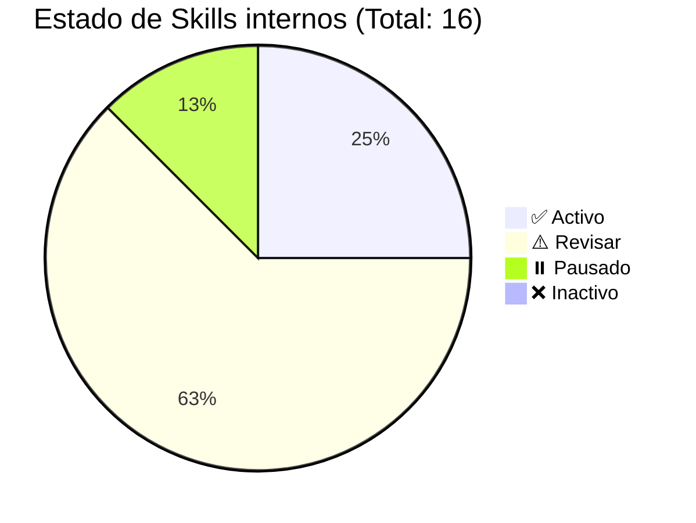
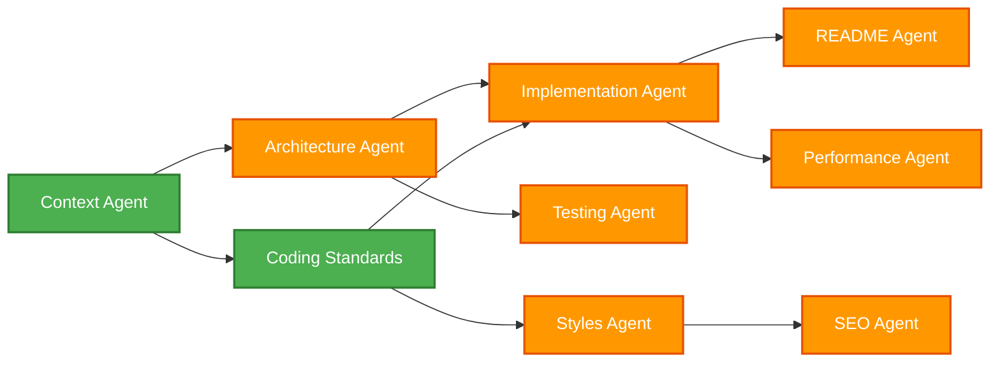
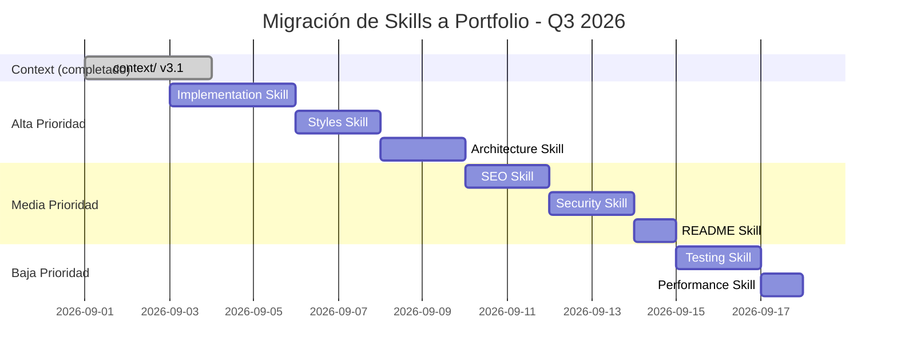

# 📋 Registro de Agentes Activos

> ⚠️ **FUENTE PRIMARIA:** Las agent skills instaladas por el CLI viven en `.agents/skills/` y disponen de `skills-lock.json`.
> Cada skill es autocontenido con su documentación en `references/`.
> `ai-docs/skills/` y `ai-docs/addy-agent-skills/` son copias anteriores pendientes de consolidación; no deben recibir nuevas skills activas.
> Los archivos en `agents/` son **legacy** — mantener solo como referencia histórica.
> Ver [ai-docs/skills/README.md](../../ai-docs/skills/README.md) para el índice actualizado.

> **Última actualización global:** 2026-09-03  
> **Estado del proyecto:** `context/` actualizado a v3.1 (Portfolio Personal / React 19). Las skills propias pendientes de adaptación permanecen en revisión.

---

**Versión del registro:** 3.1

---

## 📊 Estado de Agentes

| Skill | Tipo | Skill (fuente) | Legacy | Estado | Última revisión | Notas |
| :--- | :--- | :--- | :--- | :--- | :--- | :--- |
| **Estándares de Código** | Normativo | `.agents/skills/` (seleccionar skill aplicable) | `agents/normative/coding_standards_agent.md` | ⚠️ Revisar | 2026-09-03 | La fuente instalada debe adaptarse a `context/rules/coding_standards.md` antes de declararla específica del proyecto |
| **Arquitectura** | Normativo | `.agents/skills/` (seleccionar skill aplicable) | `agents/production/architecture_agent.md` | ⚠️ Revisar | 2026-09-03 | La fuente instalada debe validarse frente a la arquitectura por componentes del proyecto |
| **Contexto** | Utility | `ai-docs/skills/context-agent/SKILL.md` | — | ✅ Activo | 2026-09-01 | `project_profile.md` y `author_profile.md` migrados a Portfolio |
| **Licencias** | Compliance | `ai-docs/skills/license-agent/SKILL.md` | `agents/compliance/license_agent.md` | ✅ Activo | 2026-01-04 | MIT + auditoría dependencias npm, sin cambio mayor |
| **Brainstorming** | Utility | `ai-docs/skills/brainstorming-agent/SKILL.md` | — | ✅ Activo | 2026-01-26 | Meta-skill, independiente del stack |
| **Skill Creator** | Utility | `ai-docs/skills/skill-creator/SKILL.md` | — | ✅ Activo | 2026-01-26 | Meta-skill para crear nuevos skills |
| **Implementación** | Producción | `ai-docs/skills/implementation-agent/SKILL.md` | `agents/production/implementation_agent.md` | 🔄 En actualización | 2026-09-03 | Migrando de Vanilla JS a React 19 |
| **Testing** | Producción | `ai-docs/skills/testing-agent/SKILL.md` | `agents/production/testing_agent.md` | ⚠️ Revisar | 2026-01-05 | Sin runner de tests en el proyecto; umbrales aspiracionales en `quality_gates.md` |
| **Performance** | Producción | `ai-docs/skills/performance-agent/SKILL.md` | `agents/production/performance_agent.md` | ⚠️ Revisar | 2026-01-05 | Conceptos válidos (Core Web Vitals), ejemplos aún de Victory Royale Timer |
| **SEO** | Presentación | `ai-docs/skills/seo-agent/SKILL.md` | `agents/presentation/seo_agent.md` | ⚠️ Revisar | 2026-01-12 | JSON-LD Person/WebSite ya en `index.html`; skill pendiente de actualizar |
| **Diseño y Estilos** | Presentación | `ai-docs/skills/styles-agent/SKILL.md` | `agents/presentation/styles_agent.md` | ⚠️ Revisar | 2026-01-12 | Skill aún referencia variables.css / tema Fortnite — pendiente Tailwind v4 |
| **README / Docs** | Presentación | `ai-docs/skills/readme-agent/SKILL.md` | `agents/presentation/readme_agent.md` | ⚠️ Revisar | 2026-01-12 | Verificar que README refleje stack React actual |
| **Seguridad** | Compliance | `ai-docs/skills/security-agent/SKILL.md` | `agents/compliance/security_agent.md` | ⚠️ Revisar | 2026-01-04 | Adaptar a React (`dangerouslySetInnerHTML`, EmailJS, `.env`) |
| **Privacidad** | Compliance | `ai-docs/skills/privacy-agent/SKILL.md` | `agents/compliance/privacy_agent.md` | ⚠️ Revisar | 2026-01-04 | Revisar formulario de contacto y tratamiento de datos |
| **Legal** | Compliance | `ai-docs/skills/legal-agent/SKILL.md` | `agents/compliance/legal_agent.md` | ⚠️ Revisar | 2026-01-04 | Quitar disclaimer Epic Games; MIT sigue aplicando |
| **Idiomas / i18n** | Presentación | `ai-docs/skills/language-agent/SKILL.md` | `agents/presentation/language_agent.md` | ⏸️ Pausado | 2026-01-12 | Portfolio solo en español; i18n preparado estructuralmente pero no implementado |
| **Publicidad** | Compliance | `ai-docs/skills/ads-agent/SKILL.md` | `agents/compliance/ads_agent.md` | ⏸️ Pausado | 2026-01-04 | Portfolio no incluye monetización ni publicidad |

## 📚 Biblioteca Externa Auditada

| Biblioteca | Ubicación | Estado | Alcance |
| :--- | :--- | :--- | :--- |
| Addy's Agent Skills | `.agents/skills/` | ✅ Instalado | 25 skills gestionadas por el CLI y fijadas en `skills-lock.json` |

La instalación oficial crea `.agents/skills/` como fuente universal y symlinks compatibles como `.claude/skills/`. La copia anterior `ai-docs/addy-agent-skills/` queda pendiente de retirar tras completar la consolidación.

---

## 📊 Resumen Visual de Estados



### Métricas de Salud del Sistema

| Métrica | Valor | Estado |
|---------|-------|--------|
| **Skills Activos** | 4/16 (25%) | ⚠️ Bajo |
| **Skills Pendientes de revisión** | 10/16 (62.5%) | ⚠️ Alto |
| **Skills Pausados** | 2/16 (12.5%) | ✅ Esperado (no aplican al Portfolio) |
| **Última actualización de context** | 2026-09-03 | ✅ Completada |
| **Cobertura de `context/` v3.1** | 6/6 archivos | ✅ Completo |

> Las 25 skills externas de `ai-docs/addy-agent-skills/` no se contabilizan como activas del proyecto.

**Objetivo:** 80% de skills activos y alineados con Portfolio  
**Acción requerida:** Migrar skills de ⚠️ Revisar a React 19 / Tailwind (prioridad: implementation, styles, architecture-skill)

---

## 🔄 Cambios Recientes (2026-09-02)

### Actualización de `context/` y biblioteca externa (v3.1)

**Archivos de contexto migrados:**
- ✅ `context/identity/project_profile.md` — Identidad Portfolio Personal, stack React 19
- ✅ `context/identity/author_profile.md` — Biografía, educación y proyectos actualizados
- ✅ `context/rules/architecture_principles.md` — Arquitectura basada en componentes React
- ✅ `context/rules/coding_standards.md` — Estándares React 19 + Tailwind v4
- ✅ `context/rules/quality_gates.md` — Quality gates adaptados a Vite, ESLint, EmailJS
- ✅ `context/activation/active_agents.md` — Este registro

**Stack actual del Portfolio:**
- ✅ React 19 + Vite 7 + Tailwind CSS v4
- ✅ React Router v7 para enrutamiento
- ✅ ESLint configurado (`npm run lint`)
- ✅ Base técnica de dark mode con `ThemeToggle`; el control aún no está expuesto en la interfaz principal
- ✅ Formulario de contacto con EmailJS (variables `.env`)
- ✅ SEO: JSON-LD `Person` + `WebSite` en `index.html`

**Estructura de código actual:**
```
src/
├── components/       # HeroSection, ProjectSection, Navbar, Footer...
│   └── ui/           # toast, toaster (Radix UI)
├── pages/            # Home, NotFound
├── hooks/            # use-toast.js
├── lib/              # utils.js (cn)
├── App.jsx           # Enrutamiento principal
├── main.jsx          # Punto de entrada
└── index.css         # @theme Tailwind v4
```

**Pendiente (mejoras futuras, no bloqueantes):**
- ⏳ Extraer datos de proyectos a `lib/portfolioData.js` (actualmente en `ProjectSection.jsx`)
- ⏳ Configurar runner de tests (Vitest)
- ⏳ Migrar y validar skills en `ai-docs/skills/` de Victory Royale Timer a Portfolio
- ⏳ Evaluar skills de `ai-docs/addy-agent-skills/` de forma individual antes de incorporarlas

---

## 🎯 Skills que Necesitan Actualización

### Alta Prioridad
1. **Implementation Agent** — Adaptar de Vanilla JS a React 19 (componentes, hooks, JSX)
2. **Styles Agent** — Sustituir variables.css / Fortnite theme por Tailwind v4 + `@theme`
3. **Architecture Agent (skill en `ai-docs/skills/`)** — Skill pendiente de migrar a React 19 (context actualizado en `architecture_principles.md` v3.1)

### Media Prioridad
4. **SEO Agent** — Actualizar ejemplos con meta tags reales del Portfolio
5. **Security Agent** — EmailJS, `.env`, React XSS patterns
6. **README Agent** — Verificar README contra stack actual

### Baja Prioridad / No aplican
7. **Testing Agent** — Actualizar cuando se configure Vitest
8. **Language Agent** — ⏸️ Pausado hasta implementar i18n
9. **Ads Agent** — ⏸️ Pausado, Portfolio sin publicidad

---

## 🔗 Dependencias entre Skills



**Nota:** Consultar siempre `context/` v3.1 como fuente autoritativa. Los skills en ⚠️ Revisar y las skills externas deben validarse contra `context/rules/` antes de usarse.

---

## 🗓️ Plan de Actualización de Skills



---

## 📝 Contexto para Skills Nuevos

Si un skill es invocado por primera vez después de 2026-09-02, debe saber:

### Stack Actual
- **React 19** — Componentes funcionales con Hooks (sin clases)
- **Vite 7** — Build tool y dev server
- **Tailwind CSS v4** — Estilos con clases utilitarias y `@theme` en `index.css`
- **React Router v7** — Enrutamiento SPA
- **ESLint** — Análisis estático (`npm run lint`)
- **EmailJS** — Formulario de contacto (credenciales en `.env`)

### Estructura de Código
```
src/
├── components/      # Componentes reutilizables de UI
│   └── ui/          # Primitivos (toast, toaster)
├── pages/           # Vistas enrutables (Home, NotFound)
├── hooks/           # Custom Hooks de React
├── lib/             # Funciones puras y utilidades
├── App.jsx          # Enrutamiento principal
├── main.jsx         # Punto de entrada
└── index.css        # Estilos globales y @theme Tailwind
```

### Estándares de Código
- **Indentación:** 2 espacios (NO tabs) ⚠️ CRÍTICO
- **Idioma:** Inglés para código técnico; español para contenido visible
- **Nomenclatura:** `PascalCase.jsx` (componentes), `use*.js` (hooks), `camelCase.js` (lib)
- **Imports:** Librerías externas → componentes → hooks → lib
- **JSDoc:** Obligatorio para funciones exportadas en `lib/`

### Principios
- Arquitectura basada en componentes (Pages → Components → Hooks/Lib)
- SOLID, DRY, KISS, YAGNI
- Separation of Concerns (lógica en hooks/lib, vista en componentes)
- Sin acceso directo al DOM (usar refs o estado React)

### Fuentes Autoritativas (prioridad)
1. `context/identity/project_profile.md` — Identidad del proyecto
2. `context/identity/author_profile.md` — Perfil del autor
3. `context/rules/architecture_principles.md` — Arquitectura v3.1
4. `context/rules/coding_standards.md` — Estándares v3.1
5. `context/rules/quality_gates.md` — Quality gates v3.1

---

## 🚦 Estados de Skills

### ✅ Activo
Skill alineado con el estado actual del Portfolio. Puede consultarse directamente. Validar siempre contra `context/` v3.1.

### ⚠️ Revisar
Skill desactualizado respecto al Portfolio. **Consultar con precaución** — usar `context/rules/` como fuente autoritativa hasta que el skill sea migrado.

### ⏸️ Pausado
Skill no aplica al Portfolio actual (ej: ads, i18n). No invocar hasta que la funcionalidad exista en el proyecto.

### ❌ Inactivo
Skill obsoleto o descontinuado. No consultar.

### 🔄 En actualización
Skill en proceso de migración a Portfolio.

---

## 📋 Checklist de Actualización de Skills

Para migrar un skill a Portfolio, verificar:

- [ ] Conoce arquitectura basada en componentes React (Pages/Components/Hooks/Lib)
- [ ] Conoce que usamos React 19 + Tailwind v4 (no Vanilla JS)
- [ ] Referencia `context/rules/` v3.1 como fuente autoritativa
- [ ] Ejemplos de código usan JSX, hooks y clases Tailwind
- [ ] No referencia `season_config.json`, Clean Architecture 4 capas ni Victory Royale Timer
- [ ] Usa indentación de 2 espacios
- [ ] Respeta SOLID principles
- [ ] Referencia archivos reales del proyecto (`HeroSection.jsx`, `utils.js`, etc.)
- [ ] Estado actualizado en esta tabla
- [ ] Entrada añadida al historial de cambios

Para una skill externa, además:

- [ ] La procedencia y el commit auditado están documentados
- [ ] Se ha distinguido de las skills internas activas
- [ ] Se han excluido hooks, scripts, comandos y manifests no auditados
- [ ] Se ha validado contra `context/` antes de aplicar sus recomendaciones

---

## 📝 Templates de Actualización

### Template: Nota de Actualización de Skill
```markdown
**Skill:** [Nombre del Skill]
**Fecha:** [YYYY-MM-DD]
**Versión anterior:** [X.X]
**Versión nueva:** [X.X]

**Cambios realizados:**
- ✅ Actualizado con [característica nueva]
- ✅ Corregido [problema identificado]
- ✅ Añadido [sección nueva]
- ✅ Removido [contenido obsoleto]

**Validación:**
- [ ] Probado con casos de uso reales del Portfolio
- [ ] Revisada consistencia con `context/rules/` v3.1
- [ ] Verificadas referencias a archivos del proyecto
- [ ] Actualizado historial de cambios
- [ ] Estado actualizado en `active_agents.md`

**Próxima revisión:** [YYYY-MM-DD]
```

### Template: Registro de Cambio de Estado
```markdown
| Fecha | Skill | Estado Anterior | Estado Nuevo | Motivo | Responsable |
|-------|-------|----------------|--------------|--------|-------------|
| 2026-09-02 | Implementation | ⚠️ Revisar | ✅ Activo | Migrado a React 19 | Roberto |
| 2026-09-02 | Ads | ✅ Activo | ⏸️ Pausado | Portfolio sin publicidad | Roberto |
```

### Template: Reporte de Inconsistencia
```markdown
**Fecha:** [YYYY-MM-DD]
**Skill afectado:** [Nombre]
**Reportado por:** [Nombre]

**Descripción del problema:**
[Descripción detallada de la inconsistencia encontrada entre skill y context/]

**Impacto:**
- [ ] Bajo - Información menor desactualizada
- [ ] Medio - Puede causar confusión
- [ ] Alto - Información contradictoria crítica

**Acción recomendada:**
[Qué se debe hacer para resolver — migrar skill o actualizar context/]

**Estado:** [Pendiente/En progreso/Resuelto]
```

---

## 🔗 Referencias Rápidas

- **Perfil del Proyecto:** `context/identity/project_profile.md`
- **Perfil del Autor:** `context/identity/author_profile.md`
- **Arquitectura:** `context/rules/architecture_principles.md`
- **Estándares de Código:** `context/rules/coding_standards.md`
- **Quality Gates:** `context/rules/quality_gates.md`
- **Reglas de Activación:** `context/activation/activation_rules.md`
- **Índice de Skills:** `ai-docs/skills/README.md`

---

## Historial de Cambios del Registro

| Versión | Fecha | Cambios |
|---------|-------|---------|
| 1.0 | 2025-12-26 | Registro inicial de agentes |
| 2.0 | 2026-01-03 | • Estado post-refactor v1.0<br>• Marcados agentes que necesitan revisión<br>• Añadido contexto de Clean Architecture<br>• Añadido checklist de actualización<br>• Documentados cambios recientes |
| 2.1 | 2026-01-04 | • Diagrama pie chart de estados<br>• Métricas de salud del sistema<br>• Diagrama de dependencias<br>• Gantt de actualización |
| 2.2 | 2026-01-04 | • Templates de actualización<br>• Template de reporte de inconsistencias<br>• Documento completo y profesional |
| **3.1** | **2026-09-03** | • Contexto actualizado a v3.1<br>• Estados de Arquitectura y Estándares de Código ajustados a ⚠️ Revisar hasta completar la adaptación de sus skills<br>• Dark mode documentado como base técnica no expuesta en la interfaz principal<br>• Añadida la biblioteca externa auditada `ai-docs/addy-agent-skills/`, fuera del recuento de skills internas |
| **3.0** | **2026-09-02** | • Migración de Victory Royale Timer a Portfolio Personal<br>• Tabla dual: skill (`ai-docs/skills/`) + legacy (`agents/`)<br>• Estados coherentes: 6 Activos, 8 Revisar, 2 Pausados<br>• Contexto actualizado: React 19, Vite, Tailwind v4, EmailJS<br>• Estructura `components/pages/hooks/lib`<br>• Skills pausados: ads (sin monetización), language (sin i18n)<br>• Fuentes autoritativas: `context/` v3.0<br>• Gantt actualizado Q3 2026<br>• Checklist adaptado a React<br>• Referencias ampliadas con `quality_gates.md` y `activation_rules.md` |

---

**Responsable del registro:** Roberto Ceñera  
**Próxima revisión masiva:** 2026-12-02 (3 meses)
