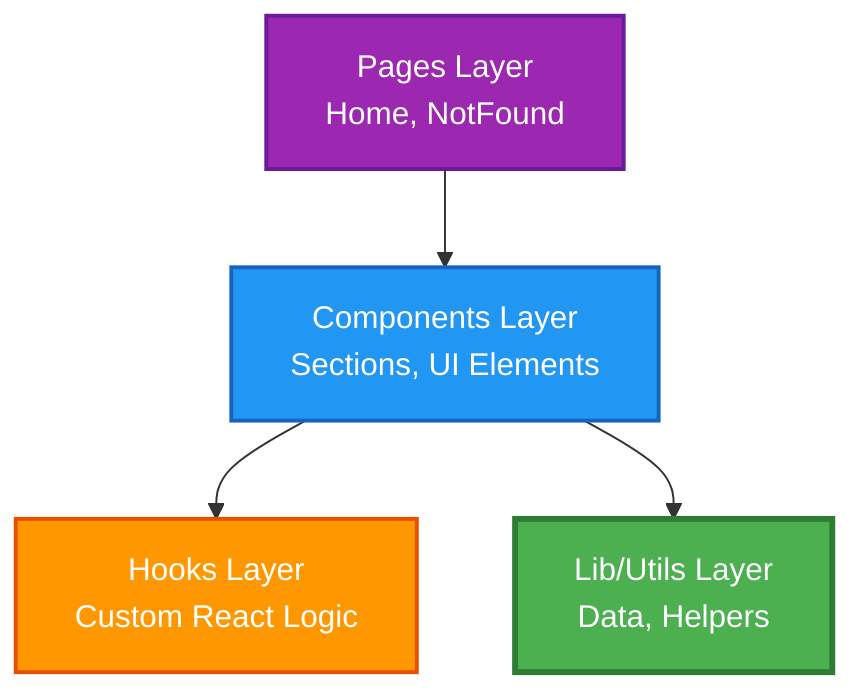

# 🎯 Identidad del Proyecto

> ⚠️ **FUENTE ÚNICA DE VERDAD**
>
> Este archivo define la identidad oficial del proyecto **concreto** en este repositorio.
> Los agentes DEBEN usar exclusivamente esta información.
> Los agentes NO PUEDEN inventar datos sobre el proyecto.

---

## 📋 Información Básica

| Campo | Valor |
| --- | --- |
| **Nombre del proyecto** | Portfolio Personal |
| **Slug/ID** | portfolio |
| **Versión actual** | 1.0.0 |
| **Estado** | Producción |
| **Tipo** | Web App (Single Page Application) |

---

## 📝 Descripción

### Una línea (tagline)
Portfolio personal moderno y dinámico para mostrar proyectos y habilidades como Desarrollador Web.

### Corta (para meta descriptions, ~160 chars)
Portfolio de Roberto Ceñera, desarrollador web especializado en React, Tailwind CSS, PHP y tecnologías modernas. Descubre mis proyectos, habilidades y contacta conmigo.

### Completa
"Portfolio Personal" es una web app enfocada en servir como carta de presentación profesional, mostrando de manera visual y atractiva mi experiencia, habilidades técnicas y proyectos destacados.

- **Problema:** Necesidad de una presencia online sólida que destaque frente a currículums tradicionales.
- **Solución:** Una web interactiva, moderna y visualmente premium.
- **Diferenciación:** Diseño cuidado con Tailwind CSS, micro-interacciones suaves, carga instantánea mediante Vite y arquitectura escalable basada en componentes de React.

---

## 🎯 Alcance Funcional

### Incluye
- Secciones interactivas (Hero, Sobre Mí, Habilidades, Proyectos, Contacto).
- Descarga directa del Curriculum Vitae.
- Formulario de contacto funcional mediante integración con EmailJS.
- Diseño 100% responsive (mobile-first) con animaciones suaves.
- Base técnica para tema claro y oscuro, pendiente de exposición completa en la interfaz principal.
- Arquitectura preparada para futuras escalabilidades.

### No incluye
- Login de usuarios.
- Backend propio o API propia para persistencia de datos.
- Base de datos en tiempo real.
- Sistema de comentarios.

---

## 🏛️ Arquitectura

### Patrón Arquitectónico
**Arquitectura Basada en Componentes (React)** estructurada en dominios funcionales:



### Capas del Sistema

1. **Pages** (`src/pages/`): Vistas enrutables completas.
2. **Components** (`src/components/`): Bloques de construcción de UI reutilizables.
3. **Hooks** (`src/hooks/`): Lógica de estado y efectos extraída para reutilización.
4. **Lib/Utils** (`src/lib/`): Configuraciones, constantes y funciones puras.

### Principios
- **DRY**: Sin código duplicado, extraer a componentes.
- **Separation of Concerns**: Lógica de datos separada de la capa visual.
- **Componentes Funcionales**: Preferencia absoluta por Hooks sobre clases.

---

## 🌍 Idiomas

| Idioma | Código | Rol |
| --- | --- | --- |
| Español | es | Idioma primario |

*(Preparado estructuralmente para futura internacionalización i18n si se requiere).*

---

## 💻 Stack Tecnológico

### Frontend
| Tecnología | Versión | Propósito |
| --- | --- | --- |
| React | 19 | Librería base para la UI |
| Vite | 7 | Build tool y servidor de desarrollo ultrarrápido |
| Tailwind CSS | v4 | Estilizado mediante clases utilitarias y variables CSS |
| React Router | 7 | Gestión de rutas de la aplicación |

### Backend / Base de Datos
| Tecnología | Versión | Propósito |
| --- | --- | --- |
| N/A | N/A | Aplicación frontend sin backend propio ni base de datos, con integraciones externas puntuales como EmailJS |

### Herramientas de Desarrollo
| Herramienta | Propósito |
| --- | --- |
| Git | Control de versiones |
| ESLint | Análisis estático de código |

---

## ⌨️ Comandos Principales

| Comando | Descripción |
| --- | --- |
| `npm run dev` | Arranca el servidor de desarrollo Vite con hot-reload |
| `npm run build` | Compila la aplicación para producción |
| `npm run preview` | Previsualiza el build de producción localmente |
| `npm run lint` | Ejecuta el análisis de ESLint |

---

## 📁 Estructura de Archivos

```text
.
├── src/
│   ├── assets/           # Imágenes y recursos estáticos
│   ├── components/       # Componentes React reutilizables
│   │   └── ui/           # Primitivos de interfaz reutilizables (toast, toaster...)
│   ├── hooks/            # Custom Hooks de React
│   ├── lib/              # Utilidades y configuración
│   ├── pages/            # Vistas principales (Home, NotFound)
│   ├── App.jsx           # Enrutamiento principal
│   ├── index.css         # Estilos globales y variables Tailwind
│   └── main.jsx          # Punto de entrada de React
├── index.html            # Plantilla base HTML
├── package.json          # Dependencias y scripts
└── vite.config.js        # Configuración del empaquetador
```

---

## 🤖 Reglas para Agentes de IA

### ✅ DEBEN
- Usar el nombre oficial del proyecto en toda documentación.
- Seguir la arquitectura basada en componentes de React.
- Usar módulos ES6 (import/export).
- Utilizar Tailwind CSS v4 para cualquier nuevo estilo.
- Respetar los colores y variables definidos en `@theme` en `index.css`.
- Documentar únicamente estructuras, rutas y funcionalidades que existan realmente en el proyecto, salvo que se indiquen explícitamente como futuras.

### ❌ NO DEBEN
- Inventar URLs, dominios o funcionalidades.
- Forzar Patrones de Clean Architecture Clásica (Domain/Infrastructure) que no apliquen a React.
- Usar CSS plano o preprocesadores ajenos a Tailwind a menos que sea para animaciones complejas en `index.css`.
- Mezclar lógica pesada de datos dentro del marcado JSX.
- Presentar mejoras futuras o ideas pendientes como si ya formaran parte del estado actual del proyecto.

---

## 📊 Historial del Proyecto

| Versión | Fecha | Cambios Principales |
|---------|-------|---------------------|
| 1.0.0 | 2026-09-01 | • Migración del contexto de agentes a React/Vite<br>• Refactorización de identidad y reglas IA |
| 0.1.0 | 2026-08-01 | • Versión inicial del Portfolio<br>• Implementación de secciones base y estilos Tailwind |

---

**Última actualización:** 2026-09-01  
**Próxima revisión:** 2027-01-01  
**Responsable:** Roberto Ceñera
