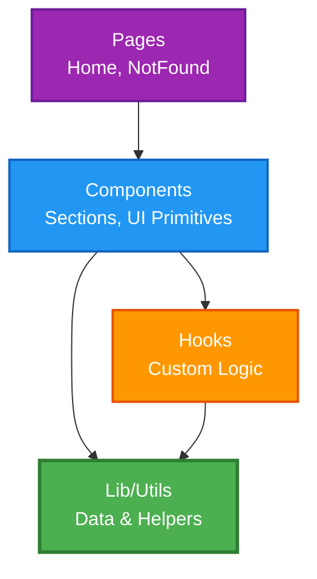
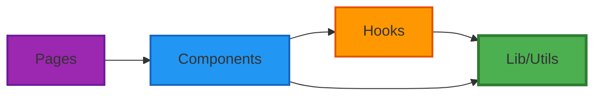

# 🏛️ Principios de Arquitectura

> Fundamentos arquitectónicos que guían el diseño técnico del proyecto **Portfolio Personal**.
> Este documento define cómo organizamos el código, cómo interactúan los componentes y qué criterios usamos para evolucionar la arquitectura con seguridad y coherencia.

---

**Última actualización:** 2026-09-03 | **Versión:** 3.1

---

## 🎯 Propósito
Establecer las **decisiones arquitectónicas** que garantizan:
- Código mantenible y escalable a largo plazo
- Separación clara de responsabilidades
- Testabilidad y flexibilidad ante cambios
- Componentización y reutilización de la UI
- Coherencia en la estructura del proyecto

---

## 📁 Estructura de Directorios

### Organización del Proyecto
```
src/
├── components/      # 🧩 Bloques de UI reutilizables
│   ├── HeroSection.jsx
│   ├── AboutSection.jsx
│   ├── SkillsSection.jsx
│   ├── ProjectSection.jsx
│   ├── ContactSection.jsx
│   ├── Navbar.jsx
│   ├── Footer.jsx
│   └── ui/          # Primitivos de UI (toast, toaster)
│
├── pages/           # 📄 Vistas enrutables completas
│   ├── Home.jsx
│   └── NotFound.jsx
│
├── hooks/           # 🎣 Custom Hooks reutilizables
│   └── use-toast.js
│
├── lib/             # 🛠️ Utilidades y configuración compartida
│   └── utils.js
│
├── assets/          # 🖼️ Imágenes, fuentes y recursos
├── App.jsx          # 🚏 Enrutamiento principal
├── index.css        # 🎨 Estilos globales y variables Tailwind
└── main.jsx         # 🚀 Punto de entrada de React
```

### Responsabilidades por Capa

| Capa | Responsabilidad | Ejemplos |
|------|----------------|----------|
| **Pages** | Vistas enrutables, composición de secciones | `Home.jsx`, `NotFound.jsx` |
| **Components** | Bloques de UI atómicos y de sección, sin lógica de negocio | `HeroSection.jsx`, `Navbar.jsx` |
| **Hooks** | Lógica de estado y efectos extraída para reutilización | `use-toast.js` |
| **Lib/Utils** | Funciones puras y utilidades compartidas | `utils.js`; los datos de proyectos y skills siguen en sus componentes |
| **UI Primitives** | Componentes base genéricos y accesibles | `toast`, `toaster` |

---

## 🏗️ Arquitectura Basada en Componentes (React)

### Diagrama de Dependencias



### 1️⃣ Pages (Vistas Enrutables)

**Responsabilidad:** Componer las secciones y definir el layout de cada ruta.

**Regla de Oro:** Las páginas **no contienen lógica de negocio ni estilos directos**. Solo componen componentes.

**Ejemplo Correcto:**
```jsx
// ✅ src/pages/Home.jsx
import { HeroSection } from '../components/HeroSection'
import { AboutSection } from '../components/AboutSection'
import { SkillsSection } from '../components/SkillsSection'
import { ProjectSection } from '../components/ProjectSection'
import { ContactSection } from '../components/ContactSection'
import { Navbar } from '../components/Navbar'
import { Footer } from '../components/Footer'

export const Home = () => {
  return (
    <>
      <Navbar />
      <main>
        <HeroSection />
        <AboutSection />
        <SkillsSection />
        <ProjectSection />
        <ContactSection />
      </main>
      <Footer />
    </>
  )
}
```

**Ejemplo Incorrecto:**
```jsx
// ❌ src/pages/Home.jsx — lógica de negocio mezclada en la página
export const Home = () => {
  const [projects, setProjects] = useState([])

  useEffect(() => {
    fetch('/api/projects').then(r => r.json()).then(setProjects) // ¡Lógica en la página!
  }, [])

  return (
    <div>
      {projects.map(p => <div key={p.id}>{p.name}</div>)} {/* ¡Sin componentizar! */}
    </div>
  )
}
```

### 2️⃣ Components (Bloques de UI)

**Responsabilidad:** Renderizar una parte de la interfaz. Pueden recibir props y usar hooks.

**Ejemplo Correcto:**
```jsx
// ✅ src/components/FeatureCard.jsx — componente reutilizable y enfocado
import { clsx } from 'clsx'

export const FeatureCard = ({ icon: Icon, title, description, className }) => {
  return (
    <div className={clsx('gradient-border p-6 card-hover', className)}>
      <div className="flex items-start gap-4">
        <div className="p-3 rounded-full bg-primary/10">
          <Icon className="h-6 w-6 text-primary" />
        </div>
        <div className="text-left">
          <h4 className="font-semibold text-lg">{title}</h4>
          <p className="text-muted-foreground">{description}</p>
        </div>
      </div>
    </div>
  )
}
```

**Ejemplo Incorrecto:**
```jsx
// ❌ Hardcodear datos directamente en el componente
export const AboutSection = () => (
  <section>
    <p>Soy desarrollador con 5 años de experiencia...</p> {/* ¡Texto hardcodeado! */}
    <p>Especializado en PHP y MySQL...</p>
  </section>
)
```

### 3️⃣ Hooks (Lógica Reutilizable)

**Responsabilidad:** Extraer y reutilizar lógica de estado y efectos de React.

El proyecto cuenta actualmente con `use-toast.js`. Otros hooks, como uno para gestionar el tema, solo deben añadirse cuando la interfaz los necesite.

**Ejemplo Correcto:**
```jsx
// ✅ Ejemplo de hook futuro para una necesidad real de la interfaz
import { useState, useEffect } from 'react'

export const useTheme = () => {
  const [isDark, setIsDark] = useState(() => {
    return localStorage.getItem('theme') === 'dark'
  })

  useEffect(() => {
    document.documentElement.classList.toggle('dark', isDark)
    localStorage.setItem('theme', isDark ? 'dark' : 'light')
  }, [isDark])

  return { isDark, toggleTheme: () => setIsDark(prev => !prev) }
}
```

### 4️⃣ Lib/Utils (Datos y Funciones Puras)

**Responsabilidad:** Centralizar datos estáticos, constantes y funciones de utilidad puras.

Actualmente `src/lib/` contiene `utils.js`; los datos de proyectos y skills siguen definidos en sus componentes. La extracción a un módulo de datos es una mejora futura, no una capa ya existente.

**Ejemplo Correcto:**
```js
// ✅ Ejemplo de futura extracción a src/lib/portfolioData.js
export const PROJECTS = [
  {
    id: 1,
    title: 'Sistema de Reservas para Restaurantes',
    description: 'Aplicación web completa con panel de administración...',
    technologies: ['PHP', 'MySQL', 'JavaScript'],
    githubUrl: 'https://github.com/slyder83/...'
  },
  // ...
]

export const SKILLS = [
  { name: 'React', level: 85 },
  { name: 'PHP', level: 80 },
  // ...
]
```

---

## 🔒 Reglas de Dependencia

### Flujo de Dependencias



### Reglas Fundamentales

| # | Regla | Descripción |
|---|-------|-------------|
| 1 | **Dirección única** | Pages importan Components, Components importan Hooks/Lib, nunca al revés |
| 2 | **Separación de datos** | Los datos nuevos o compartidos deben extraerse a `lib/`; la extracción completa de los datos actuales sigue pendiente |
| 3 | **Desacoplamiento** | Los componentes de sección no deben conocer detalles de enrutamiento |
| 4 | **Sin dependencias circulares** | Verificar con ESLint que no haya ciclos |

### Ejemplos de Violaciones Comunes

```jsx
// ❌ PROHIBIDO: Lógica de negocio en un componente de vista
// src/components/ProjectSection.jsx
export const ProjectSection = () => {
  const [projects, setProjects] = useState([])
  useEffect(() => { fetch('/api/...').then(setProjects) }, []) // ¡lógica en la vista!
  // ...
}

// ✅ CORRECTO: Datos centralizados en lib/
// src/lib/portfolioData.js
export const PROJECTS = [{ id: 1, title: '...' }]

// src/components/ProjectSection.jsx
import { PROJECTS } from '../lib/portfolioData'
export const ProjectSection = () => (
  <section>
    {PROJECTS.map(p => <ProjectCard key={p.id} {...p} />)}
  </section>
)
```

```jsx
// ❌ PROHIBIDO: Un Page con lógica mezclada
// src/pages/Home.jsx
export const Home = () => {
  const isDark = document.documentElement.classList.contains('dark') // ¡DOM directo!
  return <div style={{ background: isDark ? '#000' : '#fff' }}> ... </div>
}

// ✅ CORRECTO: Usar un Hook para la lógica
import { useTheme } from '../hooks/useTheme'
export const Home = () => {
  const { isDark } = useTheme()
  return <div className={isDark ? 'dark' : ''}> ... </div>
}

---

## 🧩 Principios Rectores

### SOLID Principles

| Principio | Descripción | Ejemplo |
|-----------|-------------|---------|
| **S** - Single Responsibility | Una clase = una razón para cambiar | `ProjectSection` solo renderiza proyectos, no calcula datos |
| **O** - Open/Closed | Abierto a extensión, cerrado a modificación | Usar interfaces para nuevos adaptadores |
| **L** - Liskov Substitution | Subclases sustituibles por su clase base | Cualquier implementación de repositorio funciona |
| **I** - Interface Segregation | Interfaces específicas > interfaces generales | `IConfigLoader` vs `IGenericService` |
| **D** - Dependency Inversion | Depender de abstracciones, no de detalles concretos | Las integraciones externas deben quedar aisladas de la UI cuando se incorporen |
// Ejemplo futuro: este hook todavía no existe en el proyecto.

### Otros Principios Clave

- **DRY (Don't Repeat Yourself):** Extraer lógica duplicada a funciones/constantes
- **KISS (Keep It Simple):** Preferir soluciones simples y nativas
- **YAGNI (You Ain't Gonna Need It):** No implementar funcionalidades futuras especulativas
- **Separation of Concerns:** Separar cálculo (lógica) del renderizado (DOM)
- **Fail Fast:** Validar entradas lo antes posible
- **Semantic HTML First:** Usar etiquetas HTML5 semánticas antes que divs genéricos

---

## 🎨 Patrones Recomendados

### Clean Architecture & Ports & Adapters (futuro)

El proyecto actual no implementa capas `Domain`, `Application` ni `Infrastructure`. Estos patrones solo deben incorporarse si la complejidad futura del producto los justifica.
```javascript
// Domain define el "puerto" (interface)
/**
 * @typedef {Object} IConfigRepository
 * @property {function(): Promise<Object>} load
 */

// Infrastructure implementa el "adaptador"
export class JSONConfigRepository {
  async load() {
    const response = await fetch('./config.json');
    return response.json();
  }
}
```

### Observer Pattern (Pub/Sub, futuro)
```javascript
// Application notifica cambios sin conocer la UI
export class CountdownService {
  subscribe(observer) {
    this.observers.push(observer);
  }
  
  notifyObservers(data) {
    this.observers.forEach(obs => obs(data));
  }
}
```

### Repository Pattern (futuro)
```javascript
// Encapsular acceso a datos
export class ConfigRepository {
  async getSeasonConfig() {
    // Abstrae si viene de JSON, API, localStorage, etc.
  }
}
```

---

## ⚠️ Anti-Patrones Comunes

### ❌ God Object
```javascript
// ❌ INCORRECTO: Una clase que hace todo
class ProjectManager {
  renderProjects() { /* ... */ }
  loadProjects() { /* ... */ }
  filterProjects() { /* ... */ }
  sendEmail() { /* ... */ }
  validateForm() { /* ... */ }
}
```

### ❌ Tight Coupling
```javascript
// ❌ INCORRECTO: UI acoplada a detalles de implementación
class ContactForm {
  constructor() {
    this.emailService = new EmailJSService(); // Acoplamiento directo
  }
}

// ✅ CORRECTO: Inyección de dependencias
class ContactForm {
  constructor(emailService) {
    this.emailService = emailService; // Abstracción
  }
}
```

### ❌ Leaky Abstractions
```javascript
// ❌ INCORRECTO: Domain exponiendo detalles de implementación
export function filterProjects() {
  const data = localStorage.getItem('projects'); // ¡Leak!
  // ...
}

// ✅ CORRECTO: Domain puro
export function filterProjects(projects, filterFn) {
  // Solo lógica pura
}
```

### ❌ Div-itis en Presentation
```html
<!-- ❌ INCORRECTO: Abuso de divs sin semántica -->
<div class="page">
  <div class="header">
    <div class="title">Portfolio Personal</div>
  </div>
  <div class="content">
    <div class="content-summary">Proyectos y habilidades</div>
  </div>
</div>

<!-- ✅ CORRECTO: HTML5 semántico -->
<div class="page-wrapper"> <!-- Solo para layout -->
  <header class="site-header">
    <h1 class="site-title">Portfolio Personal</h1>
  </header>
  <main class="main-content">
    <p class="site-description">Proyectos, habilidades y contacto</p>
  </main>
</div>
```

---

## 🛡️ Gestión de Errores

### Jerarquía de Errores
```javascript
// Estructura futura; no existe actualmente en el proyecto.
// src/lib/errors.js
export class DomainError extends Error {
  constructor(message) {
    super(message);
    this.name = 'DomainError';
  }
}

export class InvalidDateError extends DomainError {
  constructor(date) {
    super(`Invalid date: ${date}`);
    this.name = 'InvalidDateError';
  }
}

export class InfrastructureError extends Error {
  constructor(message) {
    super(message);
    this.name = 'InfrastructureError';
  }
}
```

### Propagación de Errores
```javascript
// Infrastructure captura errores técnicos
export async function loadConfig() {
  try {
    const response = await fetch('./config.json');
    return await response.json();
  } catch (error) {
    throw new InfrastructureError(`Failed to load config: ${error.message}`);
  }
}

// Application maneja errores de dominio
export class CountdownService {
  async init() {
    try {
      const config = await this.configRepository.load();
      this.validateConfig(config); // Puede lanzar DomainError
    } catch (error) {
      if (error instanceof DomainError) {
        // Manejar error de negocio
      } else {
        // Manejar error técnico
      }
    }
  }
}
```

---

## 📝 Nomenclatura y Estructura

### Convenciones de Archivos

| Tipo | Formato | Ejemplo |
|------|---------|---------|
| Componentes React | `PascalCase.jsx` | `HeroSection.jsx`, `FeatureCard.jsx` |
| Páginas (vistas) | `PascalCase.jsx` | `Home.jsx`, `NotFound.jsx` |
| Custom Hooks | `camelCase.js` (prefijo `use`) | `use-toast.js` |
| Utilidades / datos | `camelCase.js` | `utils.js`; `portfolioData.js` solo cuando se extraigan los datos |
| Estilos globales | `lowercase.css` | `index.css` |

### Sufijos Descriptivos

```
*Section.jsx     # Secciones de página (HeroSection, AboutSection)
*Card.jsx        # Tarjetas de contenido (ProjectCard, FeatureCard)
*Button.jsx      # Componentes de acción
use*.js          # Custom hooks de React
*Data.js         # Archivos de datos estáticos en lib/
```

---

## ✅ Checklist de Validación Arquitectónica

### Antes de Realizar Cualquier Cambio

#### Separación de Capas
- [ ] ¿El componente tiene una única responsabilidad?
- [ ] ¿Los datos estáticos están en `lib/` y no hardcodeados en JSX?
- [ ] ¿La lógica de estado compleja está en un Hook y no en el componente?
- [ ] ¿Las páginas solo componen componentes, sin lógica de negocio?

#### Principios SOLID
- [ ] ¿Cada componente tiene una única razón para cambiar?
- [ ] ¿Los componentes aceptan props para configuración (abiertos a extensión)?
- [ ] ¿Se reutilizan subcomponentes en lugar de duplicar JSX?

#### Accesibilidad y Semántica
- [ ] ¿Se usan etiquetas HTML5 semánticas (`<section>`, `<nav>`, `<main>`, `<article>`)?
- [ ] ¿Los elementos interactivos tienen `aria-label` cuando corresponde?
- [ ] ¿Los formularios tienen `<label>` asociados a sus inputs?
- [ ] ¿La jerarquía de encabezados (h1, h2, h3) es estrictamente secuencial?

#### Nomenclatura
- [ ] ¿Los componentes usan `PascalCase.jsx`?
- [ ] ¿Los hooks empiezan por `use`?
- [ ] ¿Los nombres son descriptivos y en español o inglés de manera consistente?

#### Estilos
- [ ] ¿Se usan clases de Tailwind en lugar de estilos inline o CSS ad-hoc?
- [ ] ¿Los colores hacen referencia a las variables de `@theme` en `index.css`?

---

## 🛠️ Herramientas de Validación

| Herramienta | Propósito | Comando |
|-------------|-----------|---------|
| **ESLint** | Detectar violaciones de estilo y arquitectura | `npm run lint` |
| **React DevTools** | Inspeccionar árbol de componentes y props | Extensión navegador |
| **Vite Build** | Verificar que la aplicación compila sin errores | `npm run build` |

---

## 📚 Referencias

### Arquitectura de Software
- **React Docs:** https://react.dev/learn
- **Thinking in React:** https://react.dev/learn/thinking-in-react
- **SOLID Principles:** https://en.wikipedia.org/wiki/SOLID

### Estándares del Proyecto
- **Coding Standards:** [`./coding_standards.md`](./coding_standards.md)
- **Quality Gates:** [`./quality_gates.md`](./quality_gates.md)

---

## 📋 Documentación de Decisiones (ADR)

### Formato de ADR
```markdown
# ADR-001: [Título de la Decisión]

## Contexto
[Descripción del problema o situación]

## Decisión
[Qué se decidió y por qué]

## Consecuencias
[Impactos positivos y negativos de la decisión]

## Alternativas Consideradas
[Otras opciones evaluadas]
```

---

## Historial de Cambios

| Versión | Fecha | Cambios |
|---------|-------|---------|
| 1.0 | 2024-12-22 | Estructura inicial |
| 1.1 | 2024-12-24 | Optimización para agentes: Inversión de dependencias, mapeo de carpetas y reglas de nomenclatura estrictas |
| 2.0 | 2026-01-04 | Diagramas Mermaid, ejemplos de código por capa, anti-patrones, jerarquía de errores, herramientas de validación |
| 2.1 | 2026-01-08 | Nueva sección Presentation Layer, estándares HTML5 semántico, principio “Semantic HTML First” |
| 3.0 | 2026-09-01 | • Migración completa de Clean Architecture (Vanilla JS) a arquitectura basada en componentes React 19<br>• Nueva estructura de directorios real (`components/`, `pages/`, `hooks/`, `lib/`)<br>• Ejemplos de código actualizados a JSX<br>• Reglas de dependencia adaptadas a React<br>• Checklist y convenciones de archivos actualizadas<br>• Referencias actualizadas a documentación oficial de React |
| **3.1** | **2026-09-03** | • Estructura, hooks y UI primitives alineados con los archivos reales del proyecto<br>• Clean Architecture y patrones avanzados marcados como futuros<br>• Ejemplos heredados de otros proyectos sustituidos por referencias al Portfolio Personal |

---

**Última actualización:** 2026-09-03  
**Responsable:** Roberto Ceñera
